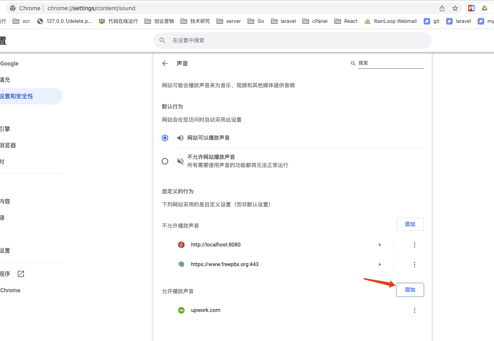
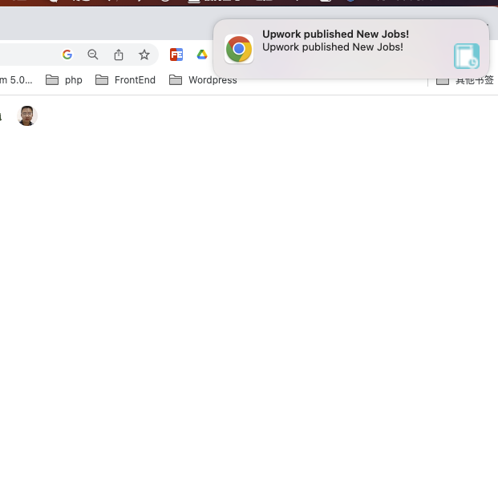

# chrome extension upwork notifications
> when stoping upwork.com [find-work page](https://www.upwork.com/nx/find-work/), the plugin will check new Jobs and push notifications. At the same time, it will play audio.

* from [https://www.youtube.com/watch?v=8OCEfOKzpAw](https://www.youtube.com/watch?v=8OCEfOKzpAw)

## setup chrome audio for upwork.com

to visit `chrome://settings/content/sound`, then enter `upwork.com`, click Add button

## Tools
[Free Text to Audio Online](https://freetts.com/)